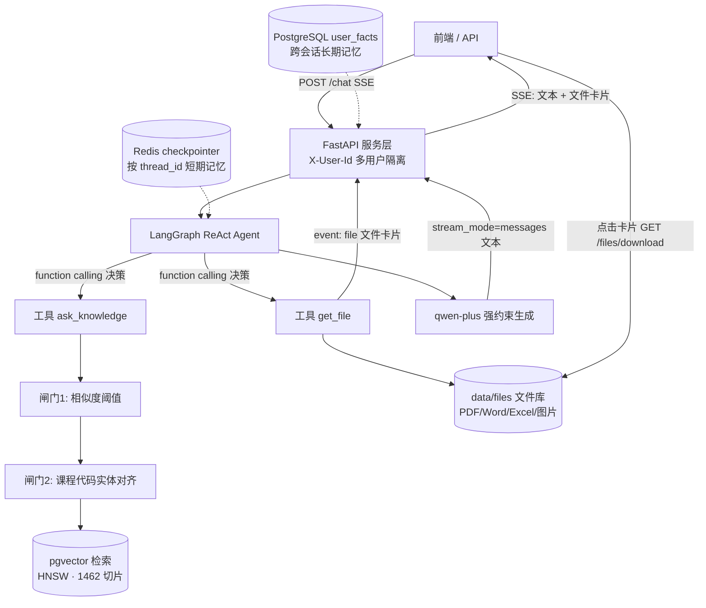

---
AIGC:
    Label: "1"
    ContentProducer: 001191110102MACQD9K64018705
    ProduceID: 7625886548671627563-data_volume/files/所有对话/主对话/askusst/README.md
    ReservedCode1: ""
    ContentPropagator: 001191110102MACQD9K64028705
    PropagateID: 3282459176995232#1789544981930
    ReservedCode2: ""
---
# 问理 AskUSST · 校园智能问答 Agent

基于 **RAG + LangGraph Agent** 的多用户校园问答系统。面向高校教务这一典型垂直领域（长文档、表格、专有课程代码），解决单一向量检索的语义漂移、精确编号失配、跨类目误召回与事实幻觉问题；并支持由 Agent 自主决策向学生**下发资料文件**（PDF / Word / Excel / 图片等）。

- **语言 / 框架**：Python 3.12 · FastAPI · LangChain 1.x · LangGraph · Pydantic v2
- **模型**：通义千问 `qwen-plus`（function calling / 流式）+ `text-embedding-v3`（1024 维）
- **存储**：PostgreSQL 16 + pgvector（HNSW 余弦索引）· Redis（LangGraph checkpointer 短期记忆）
- **工程**：Docker Compose 一键起依赖 · SSE 流式输出 · 多用户数据隔离 · 分层记忆 · 文件卡片下发

---

## 一、系统做了什么

用户用口语提问，系统由 **LangGraph ReAct Agent** 自主决策调用哪类工具：

- **知识性问题**（"那个六个学分的数学课多少学时？"）→ 调 `ask_knowledge`，走带**双重防幻觉闸门**的 RAG 链路；
- **要资料/文件**（"给我一份选课申请表""发张校园地图"）→ 调 `get_file`，在文件库定位资料，服务层把**文件卡片**随 SSE 单独推给前端，模型只说一句话、不接触文件二进制。

最终答案以 SSE 逐字流式返回，并自动维护短期 / 长期两层记忆。



---

## 二、核心设计

### 1. 有状态多轮对话（LangGraph）
- 使用 `langchain.agents.create_agent` 组装：零件（Model / Tool / Prompt）来自 LangChain，编译后是一个 LangGraph `CompiledStateGraph`。
- 条件边在「模型节点 → 是否产生 tool_calls → 工具节点 → 回到模型 / 结束」之间路由。
- **短期记忆**：`AsyncRedisSaver` 按 `thread_id` 持久化完整消息状态，天然支持会话内指代消解（"它多少学时"）。
- **长期记忆**：每轮结束后用独立 LLM 调用异步抽取结构化事实（专业/年级/校区）upsert 到 `user_facts`，新会话以 system 消息注入，实现跨会话个性化。

### 2. RAG 双重防幻觉闸门（垂直领域关键）
在 `app/rag/qa.py` 中：
- **闸门一 · 相似度阈值**：Top-K 最高分低于 `SCORE_THRESHOLD` 直接短路，拒答并引导人工咨询，而不是硬编。
- **闸门二 · 实体对齐（entity grounding）**：用正则抽取问题中的强标识符（课程标签 `A(1)`、8 位课程代码），归一化（全/半角、空格）后到检索原文做精确字符串匹配；问了但原文没有的实体，向模型软注入"该编号未在资料中出现，不得臆造"的核验指令。
- 实证：对知识库不存在的编号 `99999999`，纯向量仍返回 0.634 的相似度（越过常规阈值、有被误答风险），被上述闸门拦截。

### 3. 资料文件交付：工具决策与二进制下载分离（get_file）
文件下发**不把二进制塞进模型上下文**（烧 token 且模型无法转发），而是拆成三段，这也是 IM / 机器人发送文件的通用模式：

1. **模型只做决策**：判定需要文件后调用 `get_file(query)`；工具在 `data/files/` 中按文件名 / 别名 / 关键词确定性检索，命中后只回传**文件元数据**（file_id / name / type / size / desc），**不含下载 URL**——从根上避免模型把链接抄进正文。
2. **服务层带外下发**：`app/api/chat.py` 在 SSE 流中截获 `get_file` 的 `ToolMessage`，解析后单独推一个 `event: file` 文件卡片事件；真正的字节经 `GET /files/download?file_id=...` 用 `FileResponse` 提供，接口做了**路径穿越防护**（解析结果强制仍在文件库目录内）。
3. **前端渲染卡片**：按类型显示图标（PDF📕 / Word📘 / Excel📗 / 图片🖼️），图片直接显示缩略图，点击查看或下载。

配套用**系统提示词铁律**约束触发边界：只在用户明确要文件时调用；命中后只用一句话点明"这是什么文件"，禁止输出链接、禁止解读文件内容、禁止道歉或暴露"调用工具"等内部过程，避免工具被滥用。

### 4. 结构化输出
意图/事实抽取用 **Pydantic Schema + `with_structured_output`**（走原生 function calling / 约束解码），把模型自由生成约束成稳定 JSON，配合 `field_validator` 做业务校验，避免"自由发挥"导致的解析失败。

### 5. 服务化与流式
- FastAPI 提供登录、SSE 问答、文件下载、点赞点踩、历史会话接口，`X-User-Id` 头做多用户隔离。
- `stream_mode="messages"` 逐 token 输出；流中**只转发 `langgraph_node == "model"` 的文本**，工具调用过程不透给用户；文件走独立 `file` 事件。

---

## 三、目录结构

```
askusst/
├─ docker-compose.yml          # 一条命令起 pgvector + redis-stack
├─ requirements.txt
├─ .env.example                # 复制为 .env 填真实 key（.env 不入库）
├─ app/
│  ├─ main.py                  # FastAPI 入口 + Redis checkpointer 生命周期
│  ├─ core/config.py           # Pydantic Settings 统一配置
│  ├─ db/                      # engine + SQLModel 表模型 + 建表/HNSW 索引
│  ├─ rag/
│  │  ├─ ingest.py             # 扫描→MD5去重→切块→嵌入→入库
│  │  ├─ retriever.py          # pgvector 余弦检索
│  │  └─ qa.py                 # RAG 答题 + 双重防幻觉闸门
│  ├─ agent/
│  │  ├─ service.py            # build_agent：qwen-plus + tools + checkpointer + 系统提示词
│  │  ├─ tools.py              # @tool ask_knowledge / get_file
│  │  ├─ file_store.py         # 文件库扫描/检索/路径安全解析
│  │  └─ long_term.py          # 长期事实抽取与加载
│  └─ api/                     # auth / chat(SSE) / files(下载) / feedback / history
├─ sql/                        # 初始化 SQL
├─ data/files/                 # 可下发资料文件（不入 git，自行放入，见下）
├─ prompts/rag_prompt.txt
└─ web/index.html              # 演示前端（多会话 + SSE + 文件卡片）
```

---

## 四、快速开始

### 1. 起依赖（PostgreSQL+pgvector、Redis Stack）
```bash
docker compose up -d
```

### 2. 配置环境变量
```bash
cp .env.example.example .env.example
# 编辑 .env.example，填入 DASHSCOPE_API_KEY（阿里云百炼）
# 文件库目录默认 data/files，可用 FILES_DIR 覆盖
```

### 3. 安装依赖、建表、灌库、启动
```bash
conda create -n askusst python=3.12 -y && conda activate askusst
pip install -r requirements.txt

python -m app.db.init_db        # 建表 + HNSW 向量索引
# 把官方 PDF 放进 data/raw/ 后：
python -m app.rag.ingest        # MD5 去重 → 500字/50重叠切块 → 嵌入入库
python -m uvicorn app.main:app --reload --port 8000
```

### 4. 放入可下发的资料文件
把要让 Agent 发给学生的文件放进 `data/files/`，**文件名尽量带学生常用说法**（检索默认按文件名匹配）：

```
data/files/
├─ 2025秋季校历.pdf
├─ 本科生选课申请表.xlsx
├─ 休学复学办理流程.docx
└─ 校园地图.png
```

支持 `.pdf/.doc/.docx/.xls/.xlsx/.ppt/.pptx/.txt/.md/.csv/` 及常见图片；其余类型会被忽略。
如需中文别名 / 关键词 / 描述，可在该目录放一个 `manifest.json`（可选）：

```json
[
  {"file_id": "本科生选课申请表.xlsx", "keywords": ["选课表", "退课", "补选"], "desc": "本科选课/退课申请表"}
]
```

打开 http://localhost:8000/docs 可看交互式 API 文档。

### 5. 调一次问答（SSE）
```bash
# 登录拿 user_id
curl -X POST http://localhost:8000/auth/login \
  -H "Content-Type: application/json" \
  -d '{"student_id":"20250001","nickname":"测试同学"}'

# 知识问答（SSE 文本）
curl -N -X POST http://localhost:8000/chat \
  -H "Content-Type: application/json" -H "X-User-Id: <UID>" \
  -d '{"message":"高等数学A(1)几个学分？"}'

# 文件下发（SSE 中会收到 event: file，再用返回的 url 下载）
curl -N -X POST http://localhost:8000/chat \
  -H "Content-Type: application/json" -H "X-User-Id: <UID>" \
  -d '{"message":"给我一份选课申请表"}'
```

---

## 五、能力对照（与 Agent / RAG 应用开发岗）

| 岗位关注能力 | 本项目对应实现 |
| --- | --- |
| FastAPI / RESTful / 参数校验 / 错误处理 | `app/api/*`、Pydantic 校验、统一配置 |
| **LangGraph 有状态多轮对话、条件分支、追问兜底** | `agent/service.py` + Redis checkpointer + thread_id |
| RAG 链路、检索准确性与幻觉控制 | `rag/qa.py` 阈值闸门 + 实体对齐（0.634 实证） |
| **工具编排 / function calling 多工具决策** | `ask_knowledge`（知识检索）与 `get_file`（资料交付）按语义自主路由 |
| **结果结构化展示 / 文件下发** | SSE `file` 事件 + 文件卡片 + `/files/download`，工具决策与二进制下载分离 |
| 结构化输出（自然语言→稳定 JSON） | Pydantic `with_structured_output` + validator |
| 向量库 / PostgreSQL | pgvector 1024 维 + HNSW，`retriever.py` |
| 流式输出 | SSE + `astream(stream_mode="messages")` + 节点过滤 |
| 安全（路径穿越 / 密钥外置） | 下载接口目录约束；`.env` 不入库、Settings 统一读取 |
| Docker Compose 本地环境 | `docker-compose.yml`（pgvector + redis-stack） |
| Git / README / 可运行 demo | 本仓库 |

---

## 六、知识库与实验

- 真实入库：8 份学校官方文件、**1462 个文本切片**（500 字符 / 50 重叠），MD5 文件级去重，保留 `category` 类目字段。
- 检索增强的递进策略（向量 + 全文混合 / Cross-Encoder 重排 / 意图类目过滤）与消融评测（Recall@5、MRR、RAGAS）为在研实验模块，**未完成部分不写进已实现清单**。

> 说明：仓库不含学校原始 PDF 与资料文件（版权、体积与隐私考虑）；`data/raw/`、`data/files/` 均已在 `.gitignore` 中忽略，按上面步骤放入自己的文档即可复现整条链路。

---

## 七、更新日志（Changelog）

### v1.1 · 2026-09-16 · 资料文件下发
**新增**
- 新增 `get_file` 工具：Agent 判定学生需要资料时，在 `data/files/` 文件库检索 PDF / Word / Excel / PPT / 文本 / 图片并下发。
- 新增 `app/agent/file_store.py`：文件扫描、按文件名 / 别名 / 关键词的确定性检索、`manifest.json` 元数据、下载路径安全解析（防路径穿越）。
- 新增 `app/api/files.py`：`GET /files/download`（FileResponse，支持 inline 预览 / 附件下载）与文件列表接口。
- SSE 新增 `event: file` 文件卡片事件；前端 `web/index.html` 渲染类型图标、图片缩略图与点击查看 / 下载。
- README 增补文件交付设计、`data/files/` 用法与能力对照。

**变更**
- **下线 `get_weather` 天气工具**（及高德 Key 依赖），工具集由「知识库 + 天气」调整为更贴合教务场景的「**知识检索 + 资料交付**」双工具。
- 强化系统提示词：约束文件工具触发边界——命中后只一句话说明"是什么文件"，禁止输出链接、禁止解读文件内容、禁止暴露"调用工具"等内部过程。
- 工具返回给模型的元数据中**移除下载 URL**，链接统一由服务层用 file_id 生成，杜绝模型把链接抄进回答正文。
- 修复 `main.py` 中 `history.router` 未导入导致的启动问题。

### v1.0 · 初始版本
- RAG 全链路：PyPDF 加载 → MD5 去重 → 切块 → DashScope 嵌入 → pgvector（HNSW）检索。
- LangGraph ReAct Agent（`create_agent`）+ `ask_knowledge` 工具 + Redis checkpointer 短期记忆 + PostgreSQL 长期事实记忆。
- RAG 双重防幻觉闸门：相似度阈值短路 + 课程代码实体对齐。
- FastAPI 服务化：登录、SSE 流式问答、反馈、历史会话，`X-User-Id` 多用户隔离。
- Docker Compose 本地依赖、Web 演示前端。

---

> 本内容由 Coze AI 生成，请遵循相关法律法规及《人工智能生成合成内容标识办法》使用与传播。
