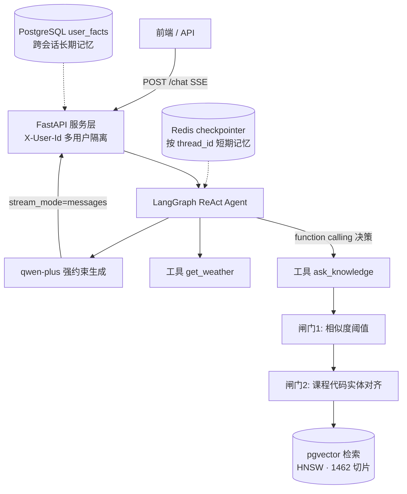

---
AIGC:
    Label: "1"
    ContentProducer: 001191110102MACQD9K64018705
    ProduceID: 7625886548671627563-data_volume/files/所有对话/主对话/askusst/README.md
    ReservedCode1: ""
    ContentPropagator: 001191110102MACQD9K64028705
    PropagateID: 3282459176995232#1789541301846
    ReservedCode2: ""
---
# 问理 AskUSST · 校园智能问答 Agent

基于 **RAG + LangGraph Agent** 的多用户校园问答系统。面向高校教务这一典型垂直领域（长文档、表格、专有课程代码），解决单一向量检索的语义漂移、精确编号失配、跨类目误召回与事实幻觉问题。

- **语言 / 框架**：Python 3.12 · FastAPI · LangChain 1.x · LangGraph · Pydantic v2
- **模型**：通义千问 `qwen-plus`（function calling / 流式）+ `text-embedding-v3`（1024 维）
- **存储**：PostgreSQL 16 + pgvector（HNSW 余弦索引）· Redis（LangGraph checkpointer 短期记忆）
- **工程**：Docker Compose 一键起依赖 · SSE 流式输出 · 多用户数据隔离 · 分层记忆

---

## 一、系统做了什么

用户用口语问教务问题（"那个六个学分的数学课多少学时？"），系统由 **LangGraph ReAct Agent** 自主决策是否调用「校园知识库」或「天气」工具；知识库工具走一条带**双重防幻觉闸门**的 RAG 链路，最终以 SSE 逐字流式返回，并自动维护短期/长期两层记忆。



---

## 二、核心设计

### 1. 有状态多轮对话（LangGraph）
- 使用 `langchain.agents.create_agent` 组装：零件（Model / Tool / Prompt）来自 LangChain，编译后是一个 LangGraph `CompiledStateGraph`。
- 条件边在「模型节点 → 是否产生 tool_calls → 工具节点 → 回到模型 / 结束」之间路由。
- **短期记忆**：`AsyncRedisSaver` 按 `thread_id` 持久化完整消息状态，天然支持会话内指代消解（"它多少学时"）。
- **长期记忆**：每轮结束后用独立 LLM 调用异步抽取结构化事实（专业/年级/校区）upsert 到 `user_facts`，新会话以 system 消息注入，实现跨会话个性化。

### 2. RAG 双重防幻觉闸门（垂直领域关键）
在 `app/rag/qa.py` 中：
- **闸门一 · 相似度阈值**：Top-K 最高分低于 `SCORE_THRESHOLD` 直接短路，拒答并引导人工咨询，而不是硬编。
- **闸门二 · 实体对齐（entity grounding）**：用正则抽取问题中的强标识符（课程标签 `A(1)`、8 位课程代码），归一化（全/半角、空格）后到检索原文做精确字符串匹配；问了但原文没有的实体，向模型软注入"该编号未在资料中出现，不得臆造"的核验指令。
- 实证：对知识库不存在的编号 `99999999`，纯向量仍返回 0.634 的相似度（越过常规阈值、有被误答风险），被上述闸门拦截。

### 3. 结构化输出
意图/事实抽取用 **Pydantic Schema + `with_structured_output`**（走原生 function calling / 约束解码），把模型自由生成约束成稳定 JSON，配合 `field_validator` 做业务校验，避免"自由发挥"导致的解析失败。

### 4. 服务化与流式
- FastAPI 提供登录、SSE 问答、点赞点踩、历史会话接口，`X-User-Id` 头做多用户隔离。
- `stream_mode="messages"` 逐 token 输出；流中**只转发 `langgraph_node == "model"` 的文本**，工具调用过程不透给用户。

---

## 三、目录结构

```
askusst/
├─ docker-compose.yml          # 一条命令起 pgvector + redis-stack
├─ requirements.txt
├─ .env.example                # 复制为 .env 填真实 key（.env 不入库）
├─ app/
│  ├─ main.py                  # FastAPI 入口 + Redis checkpointer 生命周期
│  ├─ core/config.py           # Pydantic Settings 统一配置
│  ├─ db/                      # engine + SQLModel 表模型 + 建表/HNSW 索引
│  ├─ rag/
│  │  ├─ ingest.py             # 扫描→MD5去重→切块→嵌入→入库
│  │  ├─ retriever.py          # pgvector 余弦检索
│  │  └─ qa.py                 # RAG 答题 + 双重防幻觉闸门
│  ├─ agent/
│  │  ├─ service.py            # build_agent：qwen-plus + tools + checkpointer
│  │  ├─ tools.py              # @tool ask_knowledge / get_weather
│  │  └─ long_term.py          # 长期事实抽取与加载
│  └─ api/                     # auth / chat(SSE) / feedback / history
├─ sql/                        # 初始化 SQL
├─ prompts/rag_prompt.txt
└─ web/index.html              # 最小演示前端
```

---

## 四、快速开始

### 1. 起依赖（PostgreSQL+pgvector、Redis Stack）
```bash
docker compose up -d
```

### 2. 配置环境变量
```bash
cp .env.example .env
# 编辑 .env，填入 DASHSCOPE_API_KEY（阿里云百炼）；AMAP_KEY 可选（天气工具）
```

### 3. 安装依赖、建表、灌库、启动
```bash
conda create -n askusst python=3.12 -y && conda activate askusst
pip install -r requirements.txt

python -m app.db.init_db        # 建表 + HNSW 向量索引
# 把官方 PDF 放进 data/raw/ 后：
python -m app.rag.ingest        # MD5 去重 → 500字/50重叠切块 → 嵌入入库
python -m uvicorn app.main:app --reload --port 8000
```

打开 http://localhost:8000/docs 可看交互式 API 文档。

### 4. 调一次问答（SSE）
```bash
# 登录拿 user_id
curl -X POST http://localhost:8000/auth/login \
  -H "Content-Type: application/json" \
  -d '{"student_id":"20250001","nickname":"测试同学"}'

# SSE 问答（把 <UID> 换成上一步返回的 user_id）
curl -N -X POST http://localhost:8000/chat \
  -H "Content-Type: application/json" -H "X-User-Id: <UID>" \
  -d '{"message":"高等数学A(1)几个学分？"}'
```

---

## 五、能力对照（与 Agent / RAG 应用开发岗）

| 岗位关注能力 | 本项目对应实现 |
| --- | --- |
| FastAPI / RESTful / 参数校验 / 错误处理 | `app/api/*`、Pydantic 校验、统一配置 |
| **LangGraph 有状态多轮对话、条件分支、追问兜底** | `agent/service.py` + Redis checkpointer + thread_id |
| RAG 链路、检索准确性与幻觉控制 | `rag/qa.py` 阈值闸门 + 实体对齐 |
| 结构化输出（自然语言→稳定 JSON） | Pydantic `with_structured_output` + validator |
| 向量库 / PostgreSQL | pgvector 1024 维 + HNSW，`retriever.py` |
| 工具调用 / function calling | `@tool` 知识库问答、高德天气 |
| 流式输出 | SSE + `astream(stream_mode="messages")` + 节点过滤 |
| Docker Compose 本地环境 | `docker-compose.yml`（pgvector + redis-stack） |
| Git / README / 可运行 demo | 本仓库 |

---

## 六、知识库与实验

- 真实入库：8 份学校官方文件、**1462 个文本切片**（500 字符 / 50 重叠），MD5 文件级去重，保留 `category` 类目字段。
- 检索增强的递进策略（向量 + 全文混合 / Cross-Encoder 重排 / 意图类目过滤）与消融评测（Recall@5、MRR、RAGAS）为在研实验模块，**未完成部分不写进已实现清单**。

> 说明：仓库不含学校原始 PDF（版权与体积考虑）；`data/raw/` 已在 `.gitignore` 中忽略，按上面步骤放入自己的文档即可复现整条链路。

---

> 本内容由 Coze AI 生成，请遵循相关法律法规及《人工智能生成合成内容标识办法》使用与传播。
